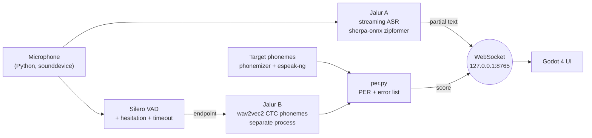

<p align="center">
  
</p>

# SpellSpeak

SpellSpeak is a pronunciation trainer for Indonesian learners of English, played as a wizard game.
You defeat monsters by saying spell words out loud. The game listens while you speak and tells you which
sound was off, for example `/θ/` in *think* heard as `/t/`, with a short hint in Indonesian on how to fix it.

Everything runs on your own laptop. No audio leaves the machine, no cloud speech or LLM API is used.

Course project for COMP6822001 Speech Recognition (BINUS).

## Why

Many Indonesian speakers swap English sounds that Bahasa Indonesia does not have:
`/θ/` and `/ð/` (*think*, *this*), `/v/` vs `/f/` (*very*, *ferry*), `/æ/` vs `/ɛ/` (*bad*, *bed*),
and final consonant clusters (*asked*, *months*). A normal speech recognizer often guesses the right word anyway,
so it hides these mistakes. SpellSpeak scores the sounds, not the word.

## One round of the game

1. The game shows a spell word, for example **think** `/θɪŋk/`. The game picks the word, not the AI.
2. You press **Cast** and speak. The microphone streams audio the whole time.
3. **Live transcript** (Jalur A): what you say appears on screen while you talk. It is display only.
4. **Endpoint**: voice activity detection notices you stopped speaking. The transcript never decides this.
5. **Phoneme check** (Jalur B): the whole utterance is turned into phonemes, with no hint about the target word.
6. `per.py` aligns target and heard phonemes and counts substitutions, deletions, and insertions (PER).
7. Runes light up per sound: green match, orange substituted, red missing or extra. Few mistakes, the monster loses HP.

## How it works



| Part | What it does | Model or tool |
| --- | --- | --- |
| Jalur A | Live partial transcript, also used for WER | sherpa-onnx streaming zipformer (Vosk small as comparison) |
| Endpoint | Decides when the player is done | Silero VAD, hesitation allowance, timeout |
| Jalur B | Heard phonemes of the whole utterance | `facebook/wav2vec2-lv-60-espeak-cv-ft`, greedy CTC, no LM |
| Target | Expected phonemes of the spell word | phonemizer + espeak-ng (same alphabet as the model) |
| Score | Phoneme Error Rate with alignment | `backend/per.py` |
| UI | Game screens, runes, HP | Godot 4, talks JSON over WebSocket |

Training and experiments run in Kaggle notebooks (`kaggle/`). The app itself runs on CPU.

## Status

| Part | State |
| --- | --- |
| `per.py` | written, has selftest |
| `server.py` | mock mode only (every message has `"mock": true`) |
| Godot UI | basic screen, needs to be opened and run in Godot |
| Jalur A, VAD, Jalur B in server | not built |
| `bench_rtf.py` | written, not run yet |
| Kaggle notebooks `NB00` to `NB04`, `NB06` | written, statically checked, not run on Kaggle yet |

No accuracy, WER, PER, or latency numbers are reported yet. Numbers will appear only from files in `results/`
written by a script or notebook that can be rerun.

## Quick start

```powershell
cd backend
python per.py                      # selftest
pip install -r requirements.txt
python server.py                   # mock backend on ws://127.0.0.1:8765
```

Then open `godot/` in Godot 4.x, press Run, press Cast. The full guide, including Kaggle and datasets, is in
[docs/RUNNING.md](docs/RUNNING.md).

## Repository

```
backend/   Python backend: server, PER, RTF benchmark, clip recorder, word bank
godot/     Godot 4 project (UI only, no audio)
kaggle/    Kaggle notebooks NB00 to NB06
docs/      plan, datasets, notebooks, game design, run guide
results/   JSON and CSV written by notebooks and scripts
```

## Docs

- [docs/RUNNING.md](docs/RUNNING.md): how to run locally and on Kaggle
- [docs/PLAN.md](docs/PLAN.md): phases and gates
- [docs/DATASETS.md](docs/DATASETS.md): datasets, licences, own recording protocol
- [docs/NOTEBOOKS.md](docs/NOTEBOOKS.md): what each Kaggle notebook measures
- [docs/GAME_DESIGN.md](docs/GAME_DESIGN.md): screens, states, tiers, hints
