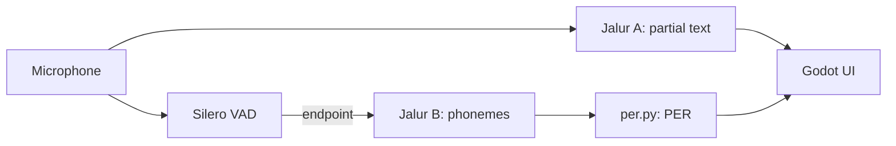

# SpellSpeak

## Flow in plain words (one round of the game)
1. The game shows a word, for example "think". The game chose it, not the AI.
2. Player presses Cast and speaks. The microphone streams audio all the time.
3. Jalur A writes what it hears on screen while the player talks (display only).
4. VAD notices the player stopped speaking. That is the endpoint. Text never decides this.
5. Jalur B turns the audio into phonemes (sound symbols), with no hints about the target word.
6. per.py compares target phonemes with heard phonemes and counts mistakes (PER).
7. The game shows which sound was wrong, for example /θ/ heard as /t/, and the monster loses HP if the mistakes are few.

## Status
| Part | State |
| --- | --- |
| per.py | written, has selftest |
| server.py | mock mode only (every message has "mock": true) |
| Godot UI | basic screen, needs to be opened and run in Godot |
| Jalur A, VAD, Jalur B in server | not built |
| bench_rtf.py | written, not run yet |
| Kaggle notebooks `kaggle/NB00` to `NB04`, `NB06` | written, statically checked, not run on Kaggle yet |

## Run order
1. `cd backend && python per.py`
2. `pip install websockets && python server.py`
3. Open `godot/` in Godot 4.x, press Run, press Cast.
4. Run `bench_rtf.py` on your own recordings (the gate for Jalur B).
5. Kaggle: upload `kaggle/NB*.ipynb`, Run All, download `results/*.json` and `*.csv` into `results/` (docs/NOTEBOOKS.md).

## Docs
See docs/PLAN.md, DATASETS.md, NOTEBOOKS.md, GAME_DESIGN.md. AI assistance is logged in AI_USAGE_LOG.md.
