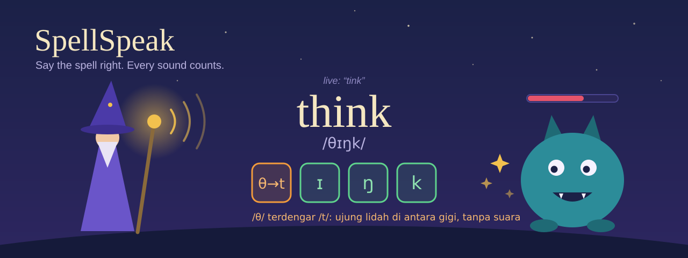
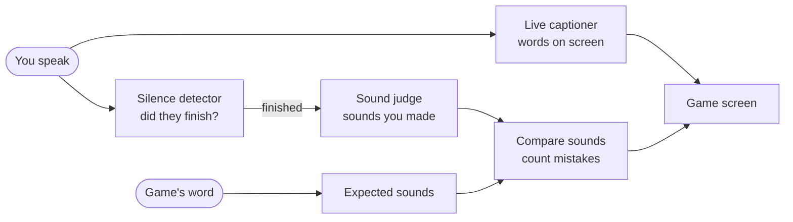

<p align="center">
  
</p>

# SpellSpeak

SpellSpeak is a pronunciation trainer for people learning to speak English, played as a wizard game.
You defeat monsters by saying spell words out loud. The game listens while you speak and tells you which
sound was off, for example `/θ/` in _think_ heard as `/t/`, with a short tip on how to fix it.

Everything runs on your own laptop. No audio leaves the machine, no cloud speech or LLM API is used.

Course project for COMP6822001 Speech Recognition (BINUS).

## Why

Many people learning to speak English swap sounds that their native language does not have:
`/θ/` and `/ð/` (_think_, _this_), `/v/` vs `/f/` (_very_, _ferry_), `/æ/` vs `/ɛ/` (_bad_, _bed_),
and final consonant clusters (_asked_, _months_). A normal speech recognizer often guesses the right word anyway,
so it hides these mistakes. SpellSpeak scores the sounds, not the word.

## One round of the game

1. The game shows a spell word, for example **think** `/θɪŋk/`. The game picks the word, not the AI.
2. You press **Cast** and speak. The microphone streams audio the whole time.
3. **Live transcript** (Jalur A): what you say appears on screen while you talk. It is display only.
4. **Endpoint**: voice activity detection notices you stopped speaking. The transcript never decides this.
5. **Phoneme check** (Jalur B): the whole utterance is turned into phonemes, with no hint about the target word.
6. `per.py` aligns target and heard phonemes and counts substitutions, deletions, and insertions (PER).
7. Runes light up per sound: green match, orange substituted, red missing or extra. Few mistakes, the monster loses HP.

## How it works

### The idea in plain words

A **phoneme** is one speech sound. The word _think_ has four: `θ`, `ɪ`, `ŋ`, `k`.
If you say "tink", you made `t` instead of `θ`. A normal speech-to-text app would still print a word close
enough to _think_ and call it fine. SpellSpeak does not care about the word. It checks the four sounds one by one.

Three helpers listen to you, and each has one job:

| Helper | Plain job | Does it affect your score? |
| --- | --- | --- |
| **Live captioner** | Shows the words on screen while you talk, like subtitles. | No. Display only. |
| **Silence detector** | Notices when you stopped talking, so the game knows your try is over. | It only decides _when_ to score. |
| **Sound judge** | Writes down the sounds it heard in your whole try, with no hint about the right answer. | Yes. This is the score. |

The game already knows which sounds the word should have. It lines up "should have" against "heard"
and counts the differences. That count, divided by the number of expected sounds, is the
**Phoneme Error Rate (PER)**. Example: expected `θ ɪ ŋ k`, heard `t ɪ ŋ k`, one wrong sound out of four, PER 0.25.

The captioner never decides the end of your try or your score. This keeps the score honest: a lucky word guess cannot hide a wrong sound.

### Data flow



Everything runs on one laptop CPU. The Python backend listens to the microphone and does the analysis.
The Godot game only draws the screen and talks to the backend over a local WebSocket.

### Under the hood

The code and docs use two Indonesian words: **Jalur** means "track" or "lane". Jalur A is the captioner,
Jalur B is the sound judge.

| Helper | Code name | Model or tool |
| --- | --- | --- |
| Live captioner | Jalur A | sherpa-onnx streaming zipformer (Vosk small as comparison) |
| Silence detector | Endpoint | Silero VAD, hesitation allowance, timeout |
| Sound judge | Jalur B | `facebook/wav2vec2-lv-60-espeak-cv-ft`, greedy CTC, no language model, separate process |
| Expected sounds | Target | phonemizer + espeak-ng (same alphabet as the judge model) |
| Compare and count | Score | PER with alignment, `backend/per.py` |
| Screen | UI | Godot 4, JSON over `ws://127.0.0.1:8765` |

The sound judge reads the whole utterance once, after the endpoint, so its delay is measured as "endpoint to score".
The captioner streams the whole time. Training and experiments run in Kaggle notebooks (`kaggle/`).

## Status

| Part                                      | State                                              |
| ----------------------------------------- | -------------------------------------------------- |
| `per.py`                                  | written, has selftest                              |
| `server.py`                               | mock mode only (every message has `"mock": true`)  |
| Godot UI                                  | basic screen, needs to be opened and run in Godot  |
| Jalur A, VAD, Jalur B in server           | not built                                          |
| `bench_rtf.py`                            | written, not run yet                               |
| Kaggle notebooks `NB00` to `NB04`, `NB06` | written, statically checked, not run on Kaggle yet |

No accuracy, WER, PER, or latency numbers are reported yet. Numbers will appear only from files in `results/`
written by a script or notebook that can be rerun.

## Quick start

```powershell
cd backend
python per.py                      # selftest
pip install -r requirements.txt
python server.py                   # mock backend on ws://127.0.0.1:8765
```

Then open `godot/` in Godot 4.x, press Run, press Cast. The full guide, including Kaggle and datasets, is in
[docs/RUNNING.md](docs/RUNNING.md).

## Repository

```
backend/   Python backend: server, PER, RTF benchmark, clip recorder, word bank
godot/     Godot 4 project (UI only, no audio)
kaggle/    Kaggle notebooks NB00 to NB06
docs/      plan, datasets, notebooks, game design, run guide
results/   JSON and CSV written by notebooks and scripts
```

## Docs

- [docs/RUNNING.md](docs/RUNNING.md): how to run locally and on Kaggle
- [docs/PLAN.md](docs/PLAN.md): phases and gates
- [docs/DATASETS.md](docs/DATASETS.md): datasets, licences, own recording protocol
- [docs/NOTEBOOKS.md](docs/NOTEBOOKS.md): what each Kaggle notebook measures
- [docs/GAME_DESIGN.md](docs/GAME_DESIGN.md): screens, states, tiers, hints
